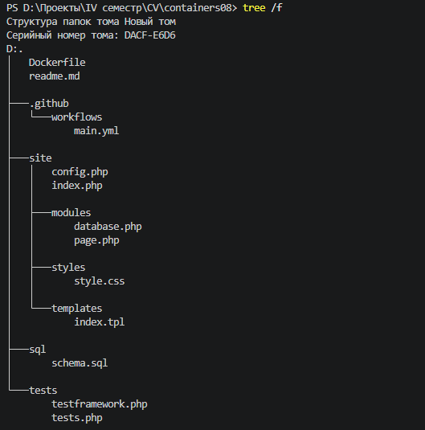
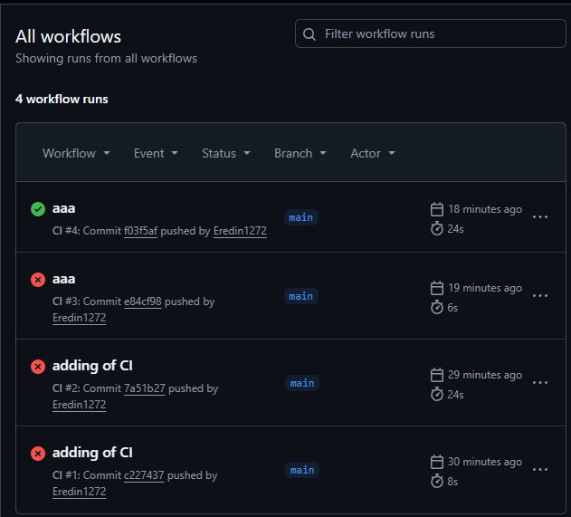

# Лабораторная работа №8. Непрерывная интеграция с помощью Github Actions

## Выполнено студетом: Britcov Egor, группа I2402
## Дата выполнения: *19.04.2026*

## Цель работы

В рамках данной работы научиться настраивать непрерывную интеграцию с помощью Github Actions.

## Задача

Создать Web приложение, написать тесты для него и настроить непрерывную интеграцию с помощью Github Actions на базе контейнеров.
 
## Ход работы

Для начала я создал репозиторий `containers08` и скопировал на пк

В директории `containers08` создал директорию `./site.` В этой  директории  будет располагаться Web приложение на базе PHP.

---

### Создание Веб-приложения

*Дальнейшие действия приведут к созданию такой схемы папок и файлов директории*



#### Класс Database

```php
<?php

class Database {
    private $pdo;

    public function __construct($path) {
        $this->pdo = new PDO("sqlite:" . $path);
    }

    public function Execute($sql) {
        return $this->pdo->exec($sql);
    }

    public function Fetch($sql) {
        $stmt = $this->pdo->query($sql);
        return $stmt->fetchAll(PDO::FETCH_ASSOC);
    }

    public function Create($table, $data) {
        $columns = implode(",", array_keys($data));
        $values = implode(",", array_map(fn($v) => "'$v'", array_values($data)));

        $sql = "INSERT INTO $table ($columns) VALUES ($values)";
        $this->Execute($sql);

        return $this->pdo->lastInsertId();
    }

    public function Read($table, $id) {
        return $this->Fetch("SELECT * FROM $table WHERE id = $id")[0] ?? null;
    }

    public function Update($table, $id, $data) {
        $set = implode(",", array_map(fn($k, $v) => "$k='$v'", array_keys($data), $data));
        return $this->Execute("UPDATE $table SET $set WHERE id = $id");
    }

    public function Delete($table, $id) {
        return $this->Execute("DELETE FROM $table WHERE id = $id");
    }

    public function Count($table) {
        return $this->Fetch("SELECT COUNT(*) as count FROM $table")[0]['count'];
    }
}
```

Класс Database реализует работу с SQLite через PDO.

Он предоставляет методы:

- Create — добавление записи
- Read — получение записи
- Update — обновление
- Delete — удаление
- Count — подсчёт записей

Таким образом реализован CRUD (основные операции с БД).

#### Класс Page

```php
<?php

class Page {
    private $template;

    public function __construct($template) {
        $this->template = $template;
    }

    public function Render($data) {
        $content = file_get_contents($this->template);

        foreach ($data as $key => $value) {
            $content = str_replace("{{{$key}}}", $value, $content);
        }

        return $content;
    }
}
```
Класс Page отвечает за отображение страницы.

Он:

- загружает HTML-шаблон
- подставляет значения ({{title}}, {{content}})

Это простейший шаблонизатор.

#### index.php

```php
<?php

require_once __DIR__ . '/modules/database.php';
require_once __DIR__ . '/modules/page.php';
require_once __DIR__ . '/config.php';

$db = new Database($config["db"]["path"]);

$page = new Page(__DIR__ . '/templates/index.tpl');

$pageId = $_GET['page'] ?? 1;

$data = $db->Read("page", $pageId);

echo $page->Render($data);
```

Файл:

- получает page из URL
- запрашивает данные из БД
- передаёт их в шаблон

Таким образом происходит генерация HTML-страницы.

### База данных

Используется SQLite.

```sql
CREATE TABLE page (
    id INTEGER PRIMARY KEY AUTOINCREMENT,
    title TEXT,
    content TEXT
);

INSERT INTO page (title, content) VALUES ('Page 1', 'Content 1');
INSERT INTO page (title, content) VALUES ('Page 2', 'Content 2');
INSERT INTO page (title, content) VALUES ('Page 3', 'Content 3');
```

Создан файл schema.sql, который:

- создаёт таблицу page
- добавляет тестовые записи

База автоматически инициализируется при сборке Docker-образа.

---

### Тестирование
#### Тестовый фреймворк

Создан простой тестовый фреймворк TestFramework, который:

- хранит список тестов
- запускает их
- считает успешные

```php
<?php

function message($type, $message) {
    $time = date('Y-m-d H:i:s');
    echo "{$time} [{$type}] {$message}" . PHP_EOL;
}

function info($message) {
    message('INFO', $message);
}

function error($message) {
    message('ERROR', $message);
}

function assertExpression($expression, $pass = 'Pass', $fail = 'Fail'): bool {
    if ($expression) {
        info($pass);
        return true;
    }
    error($fail);
    return false;
}

class TestFramework {
    private $tests = [];
    private $success = 0;

    public function add($name, $test) {
        $this->tests[$name] = $test;
    }

    public function run() {
        foreach ($this->tests as $name => $test) {
            info("Running test {$name}");
            if ($test()) {
                $this->success++;
            }
            info("End test {$name}");
        }
    }

    public function getResult() {
        return "{$this->success} / " . count($this->tests);
    }
}
```

#### Тесты 

Были реализованы тесты для:

- подключения к БД
- метода Count
- метода Create
- метода Read
- работы класса Page

Тесты проверяют корректность работы основных функций приложения.

```php
<?php

require_once __DIR__ . '/testframework.php';
require_once __DIR__ . '/../config.php';
require_once __DIR__ . '/../modules/database.php';
require_once __DIR__ . '/../modules/page.php';

$testFramework = new TestFramework();

function testDbConnection() {
    global $config;
    $db = new Database($config["db"]["path"]);
    return assertExpression($db != null, "DB connected", "DB failed");
}

function testDbCount() {
    global $config;
    $db = new Database($config["db"]["path"]);
    return assertExpression($db->Count("page") >= 3);
}

function testDbCreate() {
    global $config;
    $db = new Database($config["db"]["path"]);
    $id = $db->Create("page", ["title" => "Test", "content" => "Test"]);
    return assertExpression($id > 0);
}

function testDbRead() {
    global $config;
    $db = new Database($config["db"]["path"]);
    $data = $db->Read("page", 1);
    return assertExpression($data != null);
}

function testPageRender() {
    $page = new Page(__DIR__ . '/../templates/index.tpl');
    $html = $page->Render(["title" => "Test", "content" => "Hello"]);
    return assertExpression(strpos($html, "Test") !== false);
}

$testFramework->add('DB connection', 'testDbConnection');
$testFramework->add('DB count', 'testDbCount');
$testFramework->add('DB create', 'testDbCreate');
$testFramework->add('DB read', 'testDbRead');
$testFramework->add('Page render', 'testPageRender');

$testFramework->run();

echo $testFramework->getResult();
```

---

### Docker
#### Dockerfile

```dockerfile
FROM php:7.4-fpm as base

RUN apt-get update && \
    apt-get install -y sqlite3 libsqlite3-dev && \
    docker-php-ext-install pdo_sqlite

VOLUME ["/var/www/db"]

COPY sql/schema.sql /var/www/db/schema.sql

RUN echo "prepare database" && \
    cat /var/www/db/schema.sql | sqlite3 /var/www/db/db.sqlite && \
    chmod 777 /var/www/db/db.sqlite && \
    rm -rf /var/www/db/schema.sql && \
    echo "database is ready"

COPY site /var/www/html
```
Dockerfile выполняет:

- Устанавливает PHP + SQLite
- Создаёт базу данных
- Копирует приложение

Это позволяет запускать проект в изолированной среде.

---

### Непрерывная интеграция (CI)
#### GitHub Actions 

Настроен workflow main.yml, который:

- Клонирует репозиторий
- Собирает Docker-образ
- Создаёт контейнер
- Копирует тесты
- Запускает контейнер
- Выполняет тесты
- Останавливает и удаляет контейнер

Всё это происходит автоматически при каждом push.

---

### Тесты

Отправил  изменения в репозиторий и ждем окончания теста. Для этого переходим во вкладку `Actions` в репозитории и мониторим.



*До удачного результата, у меня возникли некоторые проблемы, а именно в одном случае просто не закинулся в репозиторий `testframework.php` , а после удачного `push-a` еще одна мелочь но по итогу все завершилось успешно.*

### Контрольные вопросы

#### Что такое непрерывная интеграция?

Непрерывная интеграция (CI) — это процесс автоматической сборки и тестирования проекта при каждом изменении кода.

Позволяет быстро находить ошибки и поддерживать стабильность проекта.

---

#### Для чего нужны юнит-тесты?

Юнит-тесты проверяют отдельные части программы (функции, методы).

Они нужны для:

- обнаружения ошибок
- проверки корректности логики
- безопасного изменения кода

Запускать их нужно:
- при каждом изменении (автоматически через CI)

---

#### Как запускать тесты при Pull Request?

В файл main.yml добавляется:

```yaml
on:
  push:
    branches:
      - main
  pull_request:
```
Теперь тесты запускаются и при создании Pull Request.

---

#### Как удалять Docker-образы?

Добавим шаг

```yaml
- name: Remove image
  run: docker rmi containers08
```

Это освобождает место и предотвращает накопление образов.

---

### Вывод

В ходе выполнения лабораторной работы было разработано Web-приложение на PHP, реализованы основные операции работы с базой данных и написаны юнит-тесты для проверки его функциональности. Также была настроена система непрерывной интеграции с использованием GitHub Actions и Docker, что позволило автоматизировать процесс сборки и тестирования приложения при каждом изменении кода.
  